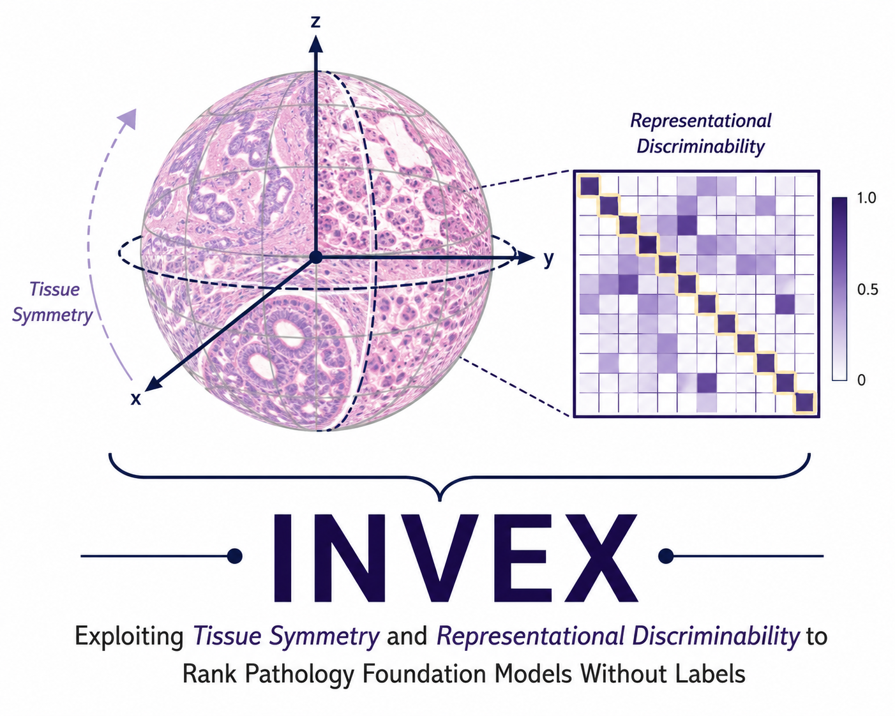

<div align="center">
  
</div>

# INVEX: INVariance × EXpressiveness for Label-Free Ranking of Pathology Foundation Models

[](https://opensource.org/licenses/MIT)
[](https://www.python.org/downloads/)
[](https://pytorch.org/)

**INVEX** is a framework that provides a purely **intrinsic, label-free** score to predict downstream performance across pathology foundation models — with no labels and no fine-tuning. A good tissue encoder *collapses* label-preserving nuisance (rotational invariance, because tissue has no canonical orientation) while *spreading* distinct biology apart (representational discriminability / effective rank). INVEX measures exactly this.


---

## 🚀 Key Features

- **Label-Free Ranking**: Predicts downstream oracle performance without needing any labels or fine-tuning.
- **High Reproducibility**: Label-free ranking (Kendall W = 0.92) is significantly more reproducible than labeled benchmarks (W = 0.51).
- **Massive Scale**: Evaluated across **28 pathology foundation models** spanning 4 paradigms and **16 public patch-level benchmarks** covering 8+ organs and >1.2M patches.
- **Probabilistic Scoring**: Uses von Mises–Fisher (vMF) concentration parameters to model invariance and expressiveness on the unit hypersphere, with Bayesian-bootstrap credible intervals.

---

## 📦 Installation

```bash
# Clone the repository
git clone https://github.com/researchsubmissions66/INVEX.git
cd INVEX

# Create environment
conda env create -f environment.yml
conda activate invex

# Or via pip:
pip install -r requirements.txt

# GPU stage only (rotated re-embedding, invariance):
pip install torch==2.5.1 timm==0.9.16
```

---

## 📂 Project Structure

```text
INVEX/
├── analysis/          # Figure generation & reporting scripts
├── pipeline/          # Pipeline phases (run via main.py)
├── utils/             # Pure metric primitives (effective_rank, kappa/vMF, retention, augmentations)
├── config.py          # Single source of truth: paths, dataset roster, encoder family map
├── main.py            # CLI dispatcher
└── Makefile           # One-command reproduction
```

---

## 🔬 Encoders (28 Models)

INVEX evaluates **28 pathology foundation models** across 4 paradigms:

### Pathology SSL (Self-Supervised Learning)
| Encoder | Backbone | Training | Dim |
| :--- | :--- | :--- | :---: |
| `uni_v1` | ViT-L/16 | DINOv2 | 1024 |
| `uni_v2` | ViT-H/14 | DINOv2 | 1536 |
| `virchow` | ViT-H/14 | DINOv2 | 2560 |
| `virchow2` | ViT-H/14 | DINOv2 | 2560 |
| `gigapath` | ViT-g/14 | DINOv2 | 1536 |
| `hoptimus0` | ViT-g/14 | DINOv2-style | 1536 |
| `hoptimus1` | ViT-g/14 | DINOv2-style | 1536 |
| `phikon` | ViT-B/16 | iBOT | 768 |
| `phikon_v2` | ViT-L/16 | DINOv2 | 1024 |
| `hibou_l` | ViT-L/14 | DINOv2 | 1024 |
| `gpfm` | ViT-L | Multi-teacher distillation | 1024 |
| `h0-mini` | ViT-B/14 | Distillation | 768 |
| `midnight12k` | ViT-L/14 | DINOv2 (Midnight) | 1536 |
| `openmidnight` | ViT-L/14 | DINOv2 (open Midnight) | 1536 |
| `kaiko-vitb8` | ViT-B/8 | DINO | 768 |
| `kaiko-vitb16` | ViT-B/16 | DINO | 768 |
| `kaiko-vits8` | ViT-S/8 | DINO | 384 |
| `kaiko-vits16` | ViT-S/16 | DINO | 384 |
| `kaiko-vitl14` | ViT-L/14 | DINOv2 | 1024 |
| `lunit-vits8` | ViT-S/8 | DINO | 384 |
| `genbio-pathfm` | ViT (large) | SSL | 4608 |

### Pathology VLM (Vision-Language Models)
| Encoder | Backbone | Training | Dim |
| :--- | :--- | :--- | :---: |
| `conch_v1` | ViT-B/16 | Vision-language | 512 |
| `conch_v15` | ViT | Vision-language | 768 |
| `musk` | ViT-L | Vision-language | 1024 |

### Pathology Other
| Encoder | Backbone | Training | Dim |
| :--- | :--- | :--- | :---: |
| `ctranspath` | CNN+Swin-T | SRCL contrastive | 768 |

### Baselines
| Encoder | Backbone | Training | Dim |
| :--- | :--- | :--- | :---: |
| `resnet50` | ResNet-50 | ImageNet supervised | 1024 |
| `gemma4-e4b` | Gemma-3n tower | General VLM | 768 |
| `gemma4-26b` | Gemma tower | General VLM | 1152 |

---

## 🧬 Patch-Level Datasets (16 Benchmarks)

| Dataset | Organ | Task | Classes | Patches | Magnification |
| :--- | :--- | :--- | :---: | ---: | :---: |
| [MHIST](https://bmirds.github.io/MHIST/) | Colorectal | Polyp type (HP vs SSA) | 2 | 3,152 | 20× |
| [CHAOYANG](https://bupt-ai-cz.github.io/HSA-NRL/) | Colon | Tissue type | 4 | 6,160 | 20× |
| [WSSS4LUAD](https://wsss4luad.grand-challenge.org/) | Lung adeno. | Tissue type | 3 | 4,693 | 40× |
| [NCT-CRC-VAL-HE-7K](https://zenodo.org/records/1214456) | Colorectal | Tissue type (9-class, val) | 9 | 7,180 | 20× |
| [BreaKHis](https://web.inf.ufpr.br/vri/databases/breast-cancer-histopathological-database-breakhis/) | Breast | Tumor benign/malignant | 2 | 7,909 | Multi |
| [LC25000_COLON](https://github.com/tampapath/lung_colon_image_set) | Colon | Tumor benign/adeno. | 2 | 10,000 | 20× |
| [SICAPv2](https://data.mendeley.com/datasets/9xxm58dvs3/2) | Prostate | Gleason grading | 4 | 12,081 | 10× |
| [LC25000_LUNG](https://github.com/tampapath/lung_colon_image_set) | Lung | Tumor subtype (3-class) | 3 | 15,000 | 20× |
| [CCRCC_Lymphocyte](https://zenodo.org/records/7898308) | Kidney (ccRCC) | Immune vs tumor | 2 | 25,095 | 20× |
| [CCRCC_Tissue](https://zenodo.org/records/7898308) | Kidney (ccRCC) | Tissue type (6-class) | 6 | 52,713 | 20× |
| [digestPath](https://digestpath2019.grand-challenge.org/) | Colon/GI | Lesion cancerous/non | 2 | 70,379 | 20× |
| [NCT-CRC](https://zenodo.org/records/1214456) | Colorectal | Tissue type (9-class, train) | 9 | 107,180 | 20× |
| [Kather-MSI-CRC](https://zenodo.org/records/2530835) | Colorectal | Molecular MSI/MSS | 2 | 192,312 | 20× |
| [Kather-MSI-STAD](https://zenodo.org/records/2530835) | Stomach | Molecular MSI/MSS | 2 | 218,578 | 20× |
| [TCGA-TILs](https://doi.org/10.5281/zenodo.6604094) | Pan-cancer | TIL detection | 2 | 227,699 | 20× |
| [PCam](https://github.com/basveeling/pcam) | Lymph node | Metastasis normal/tumor | 2 | 327,680 | 10× |

---

## 🛠️ Usage

### Prerequisites

1. **Configure paths** in `config.py`:
   - `FEAT`: Root directory containing pre-extracted patch features (one HDF5 file per encoder per dataset).
   - `META`: Root directory containing raw patch images and metadata CSVs (needed for invariance re-embedding).

2. **Feature directory layout** — each dataset folder must contain `features_<encoder>.h5` files:
   ```text
   PATCH_Features/
   ├── MHIST/
   │   ├── features_uni_v1.h5
   │   ├── features_uni_v2.h5
   │   ├── features_virchow.h5
   │   └── ...
   ├── CHAOYANG/
   │   └── ...
   └── ...
   ```

---

### Step 1 — Downstream Oracle (CPU)
Compute the labeled ground truth via patient-grouped linear probe and consensus baseline:
```bash
python main.py reproducibility
```

### Step 2 — Rotation Invariance (GPU)
Apply dihedral rotations (90°, 180°, 270°) to patches, re-embed through each frozen encoder, and measure neighborhood preservation (`retention@10`). Run once **per encoder**:
```bash
# Single encoder
python main.py invariance --encoder uni_v2 --save_emb

# All 28 encoders (loop)
for enc in uni_v1 uni_v2 virchow virchow2 gigapath hoptimus0 hoptimus1 \
           phikon phikon_v2 hibou_l gpfm h0-mini midnight12k openmidnight \
           kaiko-vitb8 kaiko-vitb16 kaiko-vits8 kaiko-vits16 kaiko-vitl14 \
           lunit-vits8 genbio-pathfm conch_v1 conch_v15 musk ctranspath \
           resnet50 gemma4-e4b gemma4-26b; do
    python main.py invariance --encoder "$enc" --n 4000 --bs 128
done
```

### Step 3 — Aggregate Invariance (CPU)
Aggregate the per-encoder invariance results from Step 2:
```bash
python main.py analyze
```

### Step 4 — Combined Metric (CPU)
Compute effective rank, vMF concentration parameters, and the combined INVEX score with bootstrap confidence intervals:
```bash
python main.py probabilistic
```

### Step 5 — kNN Oracle (CPU)
Compute the kNN-based downstream oracle as a secondary validation target:
```bash
python main.py knn
```

### Step 6 — Generate Figures & Tables (CPU)
```bash
make all         # runs everything below in order

make metrics     # rebuild results/encoder_metrics.csv (master per-encoder table)
make figures     # hero scatter, leaderboard, top-k/regret, mechanism, baselines
make tables      # ablation table + dataset/encoder reference CSVs
make sensitivity # parameter sweeps (α-weight, angles, k/N/seed, measure, data-efficiency)
```

---

## 🔬 Methodology

INVEX implements a multi-stage evaluation pipeline:

1. **Invariance (GPU)**: For each encoder, apply dihedral rotations (90°, 180°, 270°) to patches, re-embed through the frozen encoder, and measure how well the neighborhood structure is preserved (`retention@10`). A good encoder maps rotated tissue to the same region of embedding space.

2. **Expressiveness (CPU)**: Compute effective rank and uniformity of the clean embedding cloud. A good encoder uses many dimensions — distinct biology lands in distinct parts of the embedding space.

3. **Combined Score**: Model directions with von Mises–Fisher (vMF) distributions on the unit hypersphere. The quality likelihood-ratio $Q_{\text{vMF}} = \log \kappa_{\text{nuis}} - \log \kappa_{\text{bio}}$ captures both invariance (tight clustering under rotation) and expressiveness (diffuse spread across biology). The final INVEX score is $z(\text{retention}) + z(\text{effrank})$.

4. **Validation (CPU)**: Patient-grouped linear probe and kNN oracles provide the downstream ground truth. INVEX's label-free ranking is evaluated via Spearman/Kendall rank correlation against these oracles.

---

## 🙏 Acknowledgements

This project builds upon the following open-source tools from the [Mahmood Lab](https://faisal.ai/):
- [TRIDENT](https://github.com/mahmoodlab/TRIDENT) — Scalable whole-slide image processing and feature extraction toolkit.
- [Patho-Bench](https://github.com/mahmoodlab/Patho-Bench) — Standardized benchmarking library for pathology foundation models.

---

## 📄 License

This project is licensed under the **MIT License** — see the [LICENSE](LICENSE) file for details.
